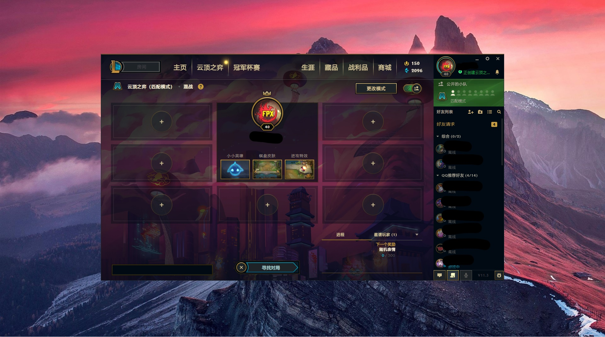

# yunding
云顶之弈-自动挂机（默认18分钟一局）

## description
因为使用了robotjs,
而robotjs依赖windows-build-tools,
所以要先装windows-build-tools

1. 准备工作
打开客户端之后不要动客户端，默认客户端是居中的。千万不要移动客户端啊，我是按照百分比定位的，~~跟分辨率应该没关系~~。
进入到云顶之弈寻找对局页面。
所以，应该是下面这样的



2. 因为需要***管理员权限***，所以请使用管理员权限打开cmd或者powerShell，或者bash，管理员权限就行（终端请不要挡住`寻找对局`的按钮），然后输入以下三条命令

强调一下，要管理员权限
```
npm install --global --production windows-build-tools
npm install
npm run play
```


